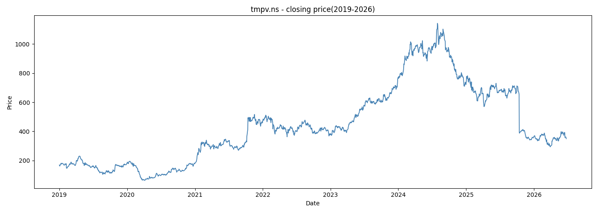

# Tata Motors Stock Price Prediction - V2

Predicting the next day closing price of Tata Motors stock using a Bidirectional LSTM model trained on 7 years of historical price data.

---

## What's different from V1

V1 used news sentiment and linear regression. V2 uses only historical closing prices and a BiLSTM — a deep learning model that learns temporal patterns in price sequences. No sentiment, no same-day features, no data leakage.

---

## Data

- Ticker: TMPV.NS (Tata Motors Passenger Vehicles, NSE)
- Period: January 2019 – June 2026
- Trading days: 1849
- Input feature: Closing price only
- Lookback window: 60 days

---

## Model Architecture

5 layers total:

- BiLSTM (64 units, return_sequences=True) — reads 60 day sequence forward and backward, outputs 128 dimensional vector at each timestep
- Dropout (0.2)
- BiLSTM (32 units, return_sequences=False) — compresses entire sequence into one 64 dimensional vector
- Dropout (0.2)
- Dense (1) — outputs predicted next day closing price

Optimizer: Adam | Loss: MSE | Early stopping: patience=10, best weights restored at epoch 29

---

## Results

| Metric | Value |
|--------|-------|
| MAE | ₹21.08 |
| RMSE | ₹34.08 |

---

## Visualizations




---

## How to run

```bash
pip install -r requirements.txt
python data_preprocessing.py
python model.py
```

---

## Stack
Python, TensorFlow, Keras, yFinance, scikit-learn, NumPy, pandas, matplotlib

---

**V1 of this project used news sentiment and linear regression.**
[View V1 here](https://github.com/LakshmiNarayanan-Sugumar/tata_motors_stock_prediction_v1)