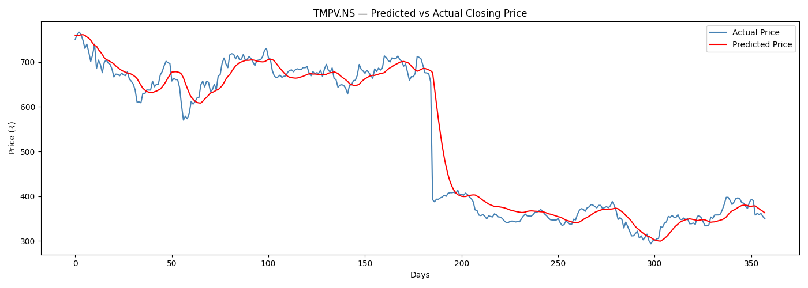
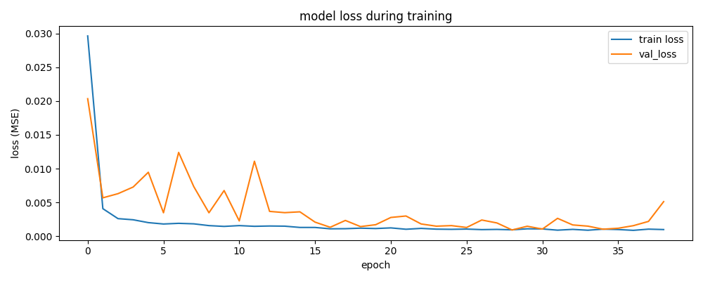

# Tata Motors Stock Price Prediction — V2

Predicting the next-day closing price of Tata Motors Passenger Vehicles (TMPV.NS) using a Bidirectional LSTM model trained on 7 years of historical price data.

---

## What's different from V1

V1 used news sentiment and linear regression. V2 uses only historical closing prices and a BiLSTM — a deep learning model that learns temporal patterns in price sequences. No sentiment, no same-day features, no data leakage.

V2 also corrects two methodological issues from an earlier iteration:

- **Scaler leakage fixed** — MinMaxScaler is now fit only on training data and applied to test data separately, preventing future price statistics from influencing the model during training.
- **Input shape fixed** — `input_shape` now correctly uses `X_train` dimensions instead of `X_test`.

---

## Data

| Field | Value |
|-------|-------|
| Ticker | TMPV.NS (Tata Motors Passenger Vehicles, NSE — post-demerger entity) |
| Period | January 2019 – June 2026 |
| Trading days | 1,849 |
| Input feature | Closing price only |
| Lookback window | 60 days |

---

## Data Pipeline

- Raw closing prices fetched via yFinance
- Sliding window sequences built on unscaled prices
- Strict time-based train/test split (80/20) — no random shuffling, preserves chronological order
- MinMaxScaler fit only on training data, applied separately to test set
- Test set scaled values range 0.213–0.771 (outside 0–1, confirming scaler was fit on train only)


---

## Model Architecture

| Layer | Output Shape | Params |
|-------|-------------|--------|
| BiLSTM (64 units, return_sequences=True) | (None, 60, 128) | 33,792 |
| Dropout (0.2) | (None, 60, 128) | 0 |
| BiLSTM (32 units, return_sequences=False) | (None, 64) | 41,216 |
| Dropout (0.2) | (None, 64) | 0 |
| Dense (1) | (None, 1) | 65 |

Total params: 75,073 (293.25 KB)

Optimizer: Adam | Loss: MSE | Early stopping: patience=10, best weights restored

---

## Results

| Metric | Value |
|--------|-------|
| MAE | ₹20.43 |
| RMSE | ₹34.74 |

Evaluated on a strictly held-out test set (last 20% of trading days, ~358 days). The test period includes a significant price shock (sharp drop from ~₹680 to ~₹400), making this a harder evaluation than a stable trending stock. The model correctly tracks the crash direction with a short lag — expected behavior for a 60-day lookback model encountering a sudden shock event.

---

## Visualizations




---

## API Endpoint

Built a REST API using FastAPI to serve model predictions.

```bash
uvicorn predict_api:app --reload
```

**POST /predict** — returns next-day predicted closing price

```json
{
  "ticker": "TMPV.NS",
  "current_price": 353.20,
  "predicted_price": 348.52,
  "currency": "INR"
}
```

Interactive docs available at `http://127.0.0.1:8000/docs`

---

## How to Run

```bash
pip install -r requirements.txt
python data_preprocessing.py
python model.py
uvicorn predict_api:app --reload
```

---

## Stack

Python, TensorFlow, Keras, yFinance, scikit-learn, NumPy, pandas, matplotlib, FastAPI

---

**V1 of this project used news sentiment and linear regression.**
[View V1 here](https://github.com/LakshmiNarayanan-Sugumar/tata_motors_stock_prediction_v1)