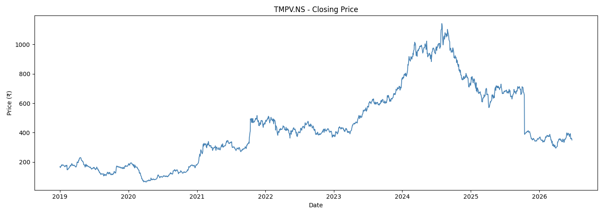
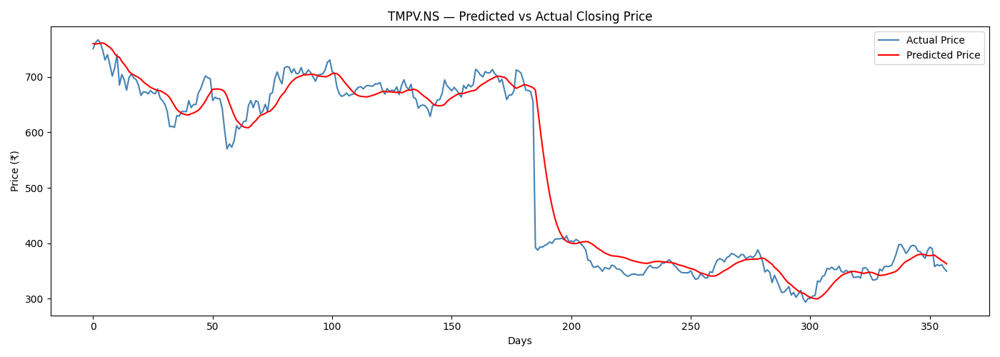

# Tata Motors Stock Price Prediction — V2

Predicting the next-day closing price of Tata Motors Passenger Vehicles (TMPV.NS) using a Bidirectional LSTM model trained on 7 years of historical price data.

---

## Results — benchmarked against a naive baseline

| Metric | Model | Naive baseline (tomorrow = today) |
|--------|-------|-------------------------------------|
| MAE | ₹18.27 | ₹8.28 |
| RMSE | ₹29.68 | ₹17.57 |

**The naive baseline has roughly 2.2x lower MAE and 1.7x lower RMSE than the model.** For a single-feature, next-day price forecast, this is a well-known and expected result: daily stock price changes are close to unpredictable, so "tomorrow's price ≈ today's price" is a genuinely hard baseline to beat, and the model's own error compounds on top of that starting point rather than improving on it.

I'm reporting this because I'd rather show an honestly benchmarked project than an inflated one. See [Known Limitations & Future Work](#known-limitations--future-work) for what would need to change to close this gap.

Evaluated on a strictly held-out, time-ordered test set (last 20% of trading days, 358 days, 2025-01-15 to 2026-06-24).

---

## A significant caveat in the test period: the Tata Motors demerger

On **14 October 2025**, Tata Motors completed a corporate demerger, splitting into separate passenger and commercial vehicle entities. This produced a **-40.2% single-day move** in the price series (₹655.31 → ₹392.20) — not a market crash, but a structural break in the data: the stock's face value changed, not its underlying worth.

This date falls **inside the test set**, roughly in the middle of it. Because the model's 60-day lookback window straddles this jump for about 60 trading days afterward, error is concentrated there:

| Segment | Days | Model MAE | Naive MAE |
|---|---|---|---|
| Before the demerger | 185 | ₹18.81 | ₹9.72 |
| Demerger day + next 59 (window still contains the jump) | 60 | ₹39.55 | ₹8.00 |
| Clean, post-demerger | 113 | ₹15.00 | ₹6.07 |

The model still trails the naive baseline in every segment, including the clean one — so the demerger explains *part* of the error, not the underlying result.

---

## What's different from V1

V1 used news sentiment and linear regression. V2 uses only historical closing prices and a BiLSTM — a deep learning model that learns temporal patterns in price sequences. No sentiment, no same-day features, no data leakage.

V2 also corrects two issues from an earlier iteration:

- **Scaler leakage fixed** — `MinMaxScaler` is fit only on training data and applied to the test set separately, so future price statistics never influence training.
- **Input shape cleanup** — `Input(shape=...)` is now built from `X_train`'s dimensions explicitly, removing an earlier redundant reference to `X_test` that had no actual effect on the model (both shapes were identical) but was misleading in the code.

---

## Data

| Field | Value |
|-------|-------|
| Ticker | TMPV.NS (Tata Motors Passenger Vehicles, NSE — post-demerger entity) |
| Period | January 2019 – June 2026 |
| Trading days | 1,849 |
| Input feature | Closing price only |
| Lookback window | 60 days |

---

## Data Pipeline

- Raw closing prices fetched via yFinance
- Sliding window sequences built on unscaled prices
- Strict time-based train/test split (80/20) — no random shuffling, preserves chronological order
- `MinMaxScaler` fit only on training data (`fit_transform`), applied separately to the test set (`transform` only) — this is what prevents leakage, not the resulting value range, which can legitimately fall inside or outside 0–1 either way depending on where prices move

---

## Model Architecture

| Layer | Output Shape | Params |
|-------|-------------|--------|
| BiLSTM (64 units, return_sequences=True) | (None, 60, 128) | 33,792 |
| Dropout (0.2) | (None, 60, 128) | 0 |
| BiLSTM (32 units, return_sequences=False) | (None, 64) | 41,216 |
| Dropout (0.2) | (None, 64) | 0 |
| Dense (1) | (None, 1) | 65 |

Total params: 75,073 (293.25 KB)

Optimizer: Adam | Loss: MSE | Early stopping: patience=10, best weights restored (fired at epoch 88) | Seed fixed (42) for reproducibility

---

## Visualizations




---

## API Endpoint

Built a REST API using FastAPI to serve model predictions.

```bash
uvicorn predict_api:app --reload
```

**POST /predict** — returns next-day predicted closing price, based on the most recent 60 trading days available at server startup

```json
{
  "ticker": "TMPV.NS",
  "as_of": "2026-06-24",
  "current_price": 352.20,
  "predicted_price": 340.60,
  "currency": "INR"
}
```

`as_of` is the date of the last closing price the prediction is based on. Price data is fetched once when the server starts, not per-request — see limitations below.

Interactive docs available at `http://127.0.0.1:8000/docs`

---

## Docker Deployment

The FastAPI serving layer (`predict_api.py`) is containerized for consistent, portable deployment, using a separate `requirements-serving.txt` so the image only carries inference dependencies, not the training stack.

**Build:**
```bash
docker build -t tata-motors-api .
```

**Run:**
```bash
docker run -p 8000:8000 tata-motors-api
```

**Test:**
```bash
curl http://localhost:8000/
curl -X POST http://localhost:8000/predict
```

### A real debugging note

The initial build used a `python:3.10-slim` base image, which failed at model load time with a Keras deserialization error (`Unrecognized keyword arguments passed to Dense: {'quantization_config': None}`). The cause wasn't a package version mismatch — it was that Keras 3.15+ requires Python ≥3.11, so the container's Python 3.10 runtime couldn't satisfy the dependency at all, regardless of how precisely `tensorflow`/`keras` were pinned in `requirements-serving.txt`. Switching the base image to `python:3.12-slim` (matching the local development environment) resolved it.

**Lesson:** pinning application-level package versions doesn't help if the base image's language runtime itself is out of range for what those packages require — check the runtime version first, not just the package versions.

### Another debugging note: the `/predict` endpoint hang

The first version of the endpoint hung on every request: no crash, no error, it just timed out. Three changes resolved it: price data is now fetched once at server startup instead of inside the request handler, TensorFlow is limited to a single thread (`tf.config.threading.set_inter_op_parallelism_threads(1)` and `set_intra_op_parallelism_threads(1)`), and the model is called directly with `model(X, training=False).numpy()` instead of `model.predict`.

---

## How to Run

**Locally:**
```bash
pip install -r requirements.txt
python data_preprocessing.py
python model.py
uvicorn predict_api:app --reload
```

**Via Docker (serving only):**
```bash
docker build -t tata-motors-api .
docker run -p 8000:8000 tata-motors-api
```

---

## Known Limitations & Future Work

- **Doesn't beat the naive baseline.** The model trails "tomorrow = today" by roughly 2.2x on MAE and 1.7x on RMSE, and still trails it on MAE in the clean, post-demerger test segment. The most direct fix would be reformulating the model to predict the next-day *return* (percent change) rather than the price level directly — this reframes the naive baseline as "predict 0% change," which the model only has to improve on incrementally, rather than reconstructing a full price level from scratch.
- **Corporate action handling.** The 14 October 2025 demerger is a structural break the pipeline doesn't currently adjust for. Back-adjusting pre-demerger prices, or excluding/flagging the affected window, would give a cleaner evaluation.
- **Single-feature input.** Only closing price is used; no volume, no other tickers, no macro features.
- **API data freshness.** `predict_api.py` fetches price history once at server startup and reuses it for the container's lifetime — a long-running deployment would serve stale `current_price`/`as_of` values without a restart. A time-based cache refresh would fix this.
- **No fixed evaluation seed until this pass.** Earlier runs weren't seeded, so reported metrics varied between runs; `set_random_seed(42)` is now used for reproducibility on CPU (GPU runs may still vary slightly).
- **Environment note:** training this model hit a reproducible TensorFlow/Keras thread-pool deadlock on Apple Silicon (M1) CPU-only local execution — the process would hang indefinitely at 0% CPU, unresponsive even to `Ctrl+C` (consistent with a native-level lock, not a Python-level issue). Root cause wasn't fully isolated; training was moved to Google Colab as a reliable workaround. Running the FastAPI serving layer locally works with the single-thread and direct-call settings described above.

---

## Stack

Python, TensorFlow, Keras, yFinance, scikit-learn, NumPy, pandas, matplotlib, FastAPI, Docker

---

**V1 of this project used news sentiment and linear regression.**
[View V1 here](https://github.com/LakshmiNarayanan-Sugumar/tata_motors_stock_prediction_v1)